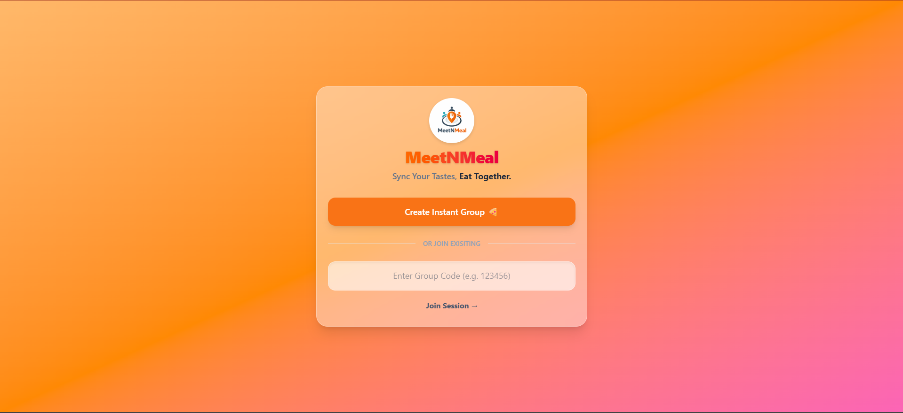
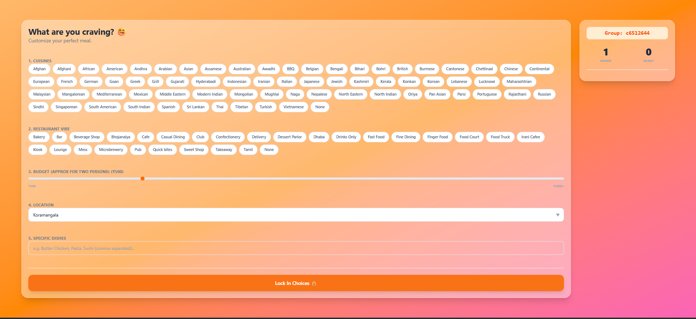
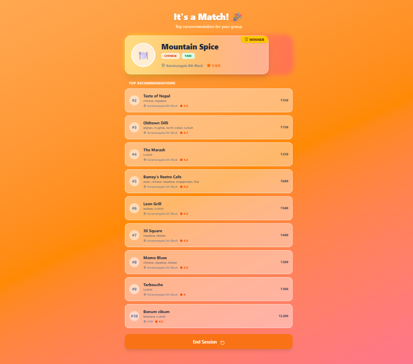

<br />
<div align="center">

  

  <h1 align="center">MeetNMeal</h1>

  <p align="center">
    <strong>Real-time Collaborative Dining Recommendation Engine</strong>
    <br />
    <br />
    <a href="#-getting-started">Getting Started</a>
    ·
    <a href="#-interface-preview">View Screenshots</a>
    ·
    <a href="https://github.com/sidnovates/MeetNMeal/issues">Report Bug</a>
  </p>

  <p align="center">
    
    
    
    
  </p>
</div>

<br />

---


> **Problem**: Choosing a restaurant with a group is often chaotic and time-consuming.  
> **Solution**: MeetNMeal is a real-time collaborative system that aggregates group preferences, resolves conflicts via a weighted scoring algorithm, and delivers optimal dining recommendations instantly.

---

## 📸 Interface Preview

### Home Screen


<details>
<summary><b>View more interface screenshots</b></summary>
<br>

### Preferences


### Results


</details>

----

## ⚡ Technical Highlights

### 🏗️ Architecture
*   **Frontend**: React (Vite) + Tailwind CSS for a responsive, modern UI.
*   **Backend**: FastAPI (Python) for high-performance asynchronous request handling.
*   **Real-time**: WebSockets for instant state synchronization (User Joins, Ready Status, Results).
*   **State Management**: Redis (with async `redis-py`) for scalable, TTL-managed session storage.

### 🧠 Recommendation Engine
*   **Hybrid Filtering**: Combines vector-based content filtering (TF-IDF on dish descriptions) with multi-criteria weighted scoring.
*   **Consensus Algorithm**: Aggregates disparate user preferences (Cuisine, Budget, Location) into a unified group profile before scoring.
*   **Geospatial awareness**: Filters and scores branches based on the group's centroid location using Haversine distance calculations.

---

## 🛡️ Robust Backend Design

Our backend is engineered for reliability and data integrity, handling edge cases proactively:

### 🔒 API Validation & Concurrency Control
*   **Compute Guard**: The recommendation engine is strictly **locked** until every participant signals `ready: true`, preventing incomplete or premature execution.
*   **Double-Submission Prevention**: Implements state-locking to reject duplicate preference submissions (`400 Bad Request`), ensuring data consistency.
*   **Race Condition Handling**: Blocks result retrieval attempts until the computation phase is fully complete (`404 Not Found`), ensuring no client reads partial states.
*   **Zero-State Handling**: Intelligently detects and blocks operations on empty groups to conserve resources.

### ⏳ Scalable Group Lifecycle
To ensure bounded memory usage in high-traffic scenarios, we implement an automatic cleanup strategy:
1.  **Groups created with expiry timestamps** (Default TTL: 30 minutes).
2.  **Redis Expiration Events** (or Background Asyncio Tasks) trigger cleanup.
3.  **Active WebSocket connections** are notified of session expiry before resource reclamation.

---

## � Real-time Event Architecture

The system employs a custom **WebSocket Protocol** managed by a singleton `ConnectionManager`, enabling sub-millisecond state synchronization across all clients.

### WebSocket Manager Pattern
*   **Singleton Instance**: A single `ConnectionManager` instance tracks all active socket connections mapped by `group_id`.
*   **Broadcast Capability**: Server-side events are pushed asynchronously to all connected clients in a specific group.
*   **Graceful Teardown**: Includes logic to safely close connections and clean up memory when a group session expires.

### Event Protocol
| Event Type | Trigger | Payload Data | description |
| :--- | :--- | :--- | :--- |
| `USER_JOINED` | User enters group | `joined_count`, `ready_count` | Live-updates the "Waiting for users" counter. |
| `USER_READY` | Preferences submitted | `user_id`, `status` | Marks a specific user avatar as "Ready" in the lobby. |
| `RESULT_COMPUTED` | Algorithm finishes | `-` | Triggers immediate navigation to the Results page for all users. |
| `SESSION_CLOSING` | 29m mark reached | `time_left` | Displays a "Session ending..." countdown overlay. |
| `SESSION_EXPIRED` | TTL (30m) reached | `message` | Forces client disconnect and redirects to Home. |

---

## �🚀 Redis Session Management

The system supports a pluggable session backend, allowing seamless switching between **In-Memory** (for development) and **Redis** (for production).

### Why Redis?
*   **Persistence**: Data survives application restarts.
*   **Automatic TTL**: Redis natively handles key expiration, removing the need for manual cleanup loops.
*   **Scalability**: Allows horizontal scaling of backend workers sharing the same state.

### Implementation Details
*   **Switching Stores**: Toggle between `session_store` and `session_redis` imports in `api/routes.py`.
*   **Redis Setup**:
    ```bash
    # Start Redis Server
    redis-server
    
    # Inspect Data CLI
    redis-cli
    > keys *        # List active groups
    > get <groupId> # View group state JSON
    ```

---

## 💻 Getting Started

### Prerequisites
*   Python 3.10+
*   Node.js 18+
*   Redis (Optional, for production mode)

### 1. Backend Setup
```bash
cd backend

# Install dependencies
pip install -r requirements.txt

# Run Server (Auto-reloads on port 8000)
python run.py
```

### 2. Frontend Setup
```bash
cd frontend

# Install dependencies
npm install

# Start Dev Server
npm run dev
```

The application will be available at `http://localhost:5173`.

### 3. Start Redis Server
To enable session management, open a new terminal and run:
```bash
redis-server
```

---

## 🔮 Future Roadmap

We are constantly innovating to make dining decisions even smoother. Here's what's cooking:

*   [ ] **AI-Powered Chat Assistant**: Integrated LLM to discuss preferences globally with the group.
*   [ ] **Mobile Application**: Native iOS/Android app using React Native for on-the-go coordination.
*   [ ] **Direct Booking Integration**: Reserve tables directly through OpenTable/Zomato APIs.
*   [ ] **User History & Analytics**: Personalized recommendations based on past dining history.

## 🤝 Contributing

We welcome contributions! Please feel free to check out the [issues](https://github.com/yourusername/MeetNMeal/issues) or submit a Pull Request.

1.  Fork the Project
2.  Create your Feature Branch (`git checkout -b feature/AmazingFeature`)
3.  Commit your Changes (`git commit -m 'Add some AmazingFeature'`)
4.  Push to the Branch (`git push origin feature/AmazingFeature`)
5.  Open a Pull Request

## 📄 License & Contact

Distributed under the MIT License. See `LICENSE` for more information.

**Built with 💙 by Siddharth**  
*Let's build something amazing together.*
